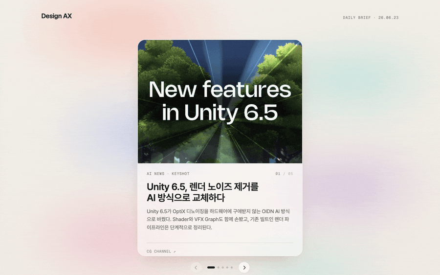

# Design AX Brief



> **Daily Design × AI News Agent**

디자인 조직의 AI 전환(AX)을 위한, 매일 자동으로 발행되는 뉴스 브리프. 6개의 AI 서브에이전트가 매일 디자인×AI 뉴스 5장을 수집·검증·선별·작성·시각화·발행해 하나의 정적 웹페이지로 만들어 줍니다.

📄 인쇄용 가이드: [`docs/design-ax-brief-guide.ko.pdf`](docs/design-ax-brief-guide.ko.pdf) · [English](docs/design-ax-brief-guide.pdf)

---

## 1. 무엇인가

**Design AX Brief**는 의존성이 거의 없는 정적 웹페이지(`Design AX Brief.html`)로, 오늘 가장 유용한 디자인×AI 뉴스 5장을 상단 히어로 캐러셀에 보여주고, 그 아래 "주간 덱"에 지난 날들의 소식을 쌓아 둡니다. 이 페이지는 단일 스킬 `/design-ax-daily-news`가 지휘하는 **6-에이전트 파이프라인**이 생성합니다. 소스 오브 트루스(원본 데이터)는 `pipeline/news_data.json` 하나이며, 나머지는 모두 여기서 파생됩니다.

- **신선 & 검증.** 기사의 *실제 게재 시각*이 직전 72시간 이내인 뉴스만 노출합니다.
- **중복 없음.** 각 뉴스는 단 하루에만 등장합니다(가장 이른 날짜 우선). 판정 기준은 URL + 내용.
- **억지 채움 없음.** 신선하고 중복 아닌 뉴스가 5개 미만이면, 실제로 존재하는 만큼만 발행합니다.
- **차분하고 미니멀한 한국어 에디토리얼 톤.** 각 카드는 기사 본문에서 가져온 고유 이미지를 씁니다.

---

## 2. 동작 방식 — 6-에이전트 파이프라인

`/design-ax-daily-news`를 실행하면 6개 서브에이전트가 **엄격한 순서대로** 동작합니다. 각 단계는 `pipeline/` 아래에 산출물 하나를 쓰고, 다음 단계가 그것을 읽습니다. 각 단계 후 오케스트레이터는 산출물이 존재하고 비어 있지 않은지 검증한 뒤에야 다음으로 넘어갑니다.

```
keyword_pool.json ─▶ 1 ax-planner   ─▶ keywords.json
keywords.json ─────▶ 2 ax-librarian ─▶ candidates.json  (~15–20개, 시각 검증)
candidates.json ───▶ 3 ax-curator   ─▶ selected.json    (상위 5개, 중복 제거)
selected.json ─────▶ 4 ax-writer    ─▶ cards.json       (한국어 카피)
cards.json ────────▶ 5 ax-media     ─▶ media.json + 이미지
cards + media ─────▶ 6 ax-publisher ─▶ axbrief-data.js + 아카이브
```

| 에이전트 | 역할 | 핵심 규칙 |
| --- | --- | --- |
| `ax-planner` | 오늘의 검색 키워드 기획. | `core` 키워드는 항상 사용; 광범위한 `keyword_pool.json`에서 날짜 기준으로 부분집합을 로테이션; 총 ~20–28개 쿼리; 최근 다룬 주제는 회피. |
| `ax-librarian` | 웹 검색 & 후보 수집. | 후보마다 기사를 직접 열어 *실제* 게재 시각을 검증(og / JSON-LD / 바이라인). `freshness.py`(고정 72h)로 게이팅. 시각 확인 불가 항목은 드롭. |
| `ax-curator` | 최적 5개 선별. | 실행가능성·신선도·신뢰도·다양성으로 점수화. 최근 5일 대비 **중복 제거**(URL+내용, 이미지 아님) 후 다음 순위로 **백필**. |
| `ax-writer` | 차분한 한국어 카피 작성. | 1줄 헤드라인(균형 잡힌 2줄 줄바꿈), 카드 폭을 꽉 채우되 ≤3줄(≤110자) 본문. 사실 창작 금지. |
| `ax-media` | 카드별 고유 비주얼 부여. | **기사 본문 내부 이미지**(제목과 본문 사이)를 1순위 → og:image → 생성 SVG. md5 비교로 두 카드가 같은 썸네일을 쓰지 않게 함. |
| `ax-publisher` | 라이브 페이지로 발행. | 어제치를 덱으로 롤(`roll.py`), `axbrief-data.js` 재생성(`build_data.py`), `node --check` 검증, 실행 결과 아카이브. |

---

## 3. 정직함을 지키는 규칙들

### 신선도 — 고정 72시간
`pipeline/freshness.py`가 모든 후보를 결정론적으로 게이팅합니다. 검증된 게재 시각이 `now` 기준 72시간 이내일 때만 통과(요일 무관 동일 창).

### 중복 없음 (URL + 내용)
두 항목은 URL/리다이렉트가 같거나, 같은 사건을 다른 매체로 다루거나, 같은 소스의 같은 주제 글이면 동일 뉴스로 봅니다. **썸네일이 같은 건 중복이 아닙니다** — 다른 기사면 둘 다 유지하고, ax-media가 각각 고유한 본문 이미지를 부여합니다.

### 가장 이른 날짜 우선 + 백필
N일에 수집된 뉴스는 N+1…N+5일에 다시 나오지 않습니다. 중복을 빼서 빈자리가 생기면 큐레이터가 15–20개 풀에서 차순위 후보를 끌어올려 채웁니다.

### 결정론적 백스톱
`roll.py`는 덱에 합쳐지는 카드 중 이미 앞선 날짜에 있는 URL을 드롭하고, `build_data.py`는 두 카드가 같은 URL을 쓰면 **빌드를 실패**시킵니다(썸네일이 겹치면 경고).

> **키워드 풀 & 로테이션.** `pipeline/keyword_pool.json`에 광범위하고 분류된 키워드 세트(AI/디자인 툴, 모델, 랩, 인물, 생성 미디어, 로보틱스)를 둡니다. 플래너는 작은 `core` 세트는 매일 검색하고, 더 큰 풀에서는 매일 다른 부분집합을 로테이션합니다 — 이로써 커버리지는 넓히면서 하루 검색량은 적정 수준으로 유지합니다.

---

## 4. 페이지 구성

> **두 가지 디자인, 하나의 데이터.** 수집 파이프라인은 디자인과 무관하게 `axbrief-data.js`(+ `pipeline/media/` 이미지) 하나만 생성하고, 두 프런트엔드가 이를 함께 읽습니다 — `Design AX Brief.html`(small/캐러셀)과 `Design AX Brief (Large Card).html`(large card). 수집 규칙은 한 곳에서만 관리되며 두 디자인이 항상 같은 뉴스로 동시 발행됩니다.

### small / 캐러셀

- **히어로 캐러셀** — 오늘의 최대 5장. 스와이프 가능하며 각 카드에 이미지·헤드라인·본문·원문 링크.
- **주간 덱**("어제까지의 모든 소식") — 지난 날들을 부채꼴 미니카드 스택으로; 날짜에 올리면 펼쳐지고, 카드를 누르면 위 히어로에서 크게 열림.
- **"오늘 소식으로" 버튼** — 과거 날짜를 보는 중에만 나타나며, 누르면 히어로를 오늘로 되돌림. (오늘은 히어로에만 있고 덱에 중복으로 들어가지 않음.)
- CDN의 React + Babel로 동작 — 빌드 단계도, 서버 프레임워크도 없음. 데이터·앱은 매 로드마다 캐시버스트되어 새 발행분이 항상 보임.

### large card

- **스크롤 확장 히어로** — `AX-it · DESIGN · NOW` 모핑 로고 + 오늘의 카드 5장 썸네일 슬라이드쇼가 전체 화면으로 확장되며 첫 뉴스 카드로 이어짐.
- **풀블리드 카드 5장** — 오늘의 소식을 화면을 꽉 채운 배너 카드로; 각 카드 배경은 기사 원문 이미지.
- **틸트 아카이브**("어제까지의 모든 소식") — 지난 날들의 카드덱이 3D 틸트업으로 펼쳐지고, 카드는 기본 블러 → 호버 시 컬러+확대, 누르면 크게 열림.

---

## 5. 프로젝트 구조

```
Design AX Brief.html              # 페이지 — small/캐러셀 디자인
axbrief-app.jsx                   # small 디자인 React UI (히어로 캐러셀·주간 덱)
Design AX Brief (Large Card).html # 페이지 — large card 디자인
axbrief-app-large.jsx             # large 디자인 React UI (스크롤 확장 히어로·풀블리드 카드·틸트 아카이브)
axbrief-data.js             # 자동 생성 데이터 (window.AX_NEWS + window.AX_DAYS) — 두 디자인이 공유
.claude/
  skills/design-ax-daily-news/SKILL.md   # /design-ax-daily-news 오케스트레이터
  agents/ax-{planner,librarian,curator,writer,media,publisher}.md
pipeline/
  keyword_pool.json     # 기본 검색 키워드 (커스터마이즈용)
  sources.json          # 카테고리: 라벨, 액센트 색, 모티프, 허용 도메인
  news_data.json        # 소스 오브 트루스 (오늘 + 지난 5일)
  freshness.py          # 72h 신선도 게이트            (+ _test.py)
  roll.py               # 오늘 -> 덱, 중복 제거          (+ _test.py)
  build_data.py         # news_data.json -> axbrief-data.js (+ _test.py)
  media/                # 다운로드된 카드 이미지(추적); deck/ = 주간 배너
  runs/<date>/          # 날짜별 전체 산출물 아카이브 (git 제외)
```

---

## 6. Clone 해서 직접 사용하기

### 사전 요건
- **Claude Code** (CLI) — 스킬과 에이전트는 `.claude/` 아래에 있으며 서브에이전트로 실행됩니다.
- **python3** 와 **node** (node는 `--check` 검증에만 사용).
- 로컬 프리뷰 & 렌더 검증용 Chromium/Chrome 브라우저.

### 일간 브리프 실행
```bash
git clone https://github.com/simonksy/design-ax-brief.git
cd design-ax-brief
claude                       # 레포에서 Claude Code 열기
> /design-ax-daily-news      # 오늘자 6-에이전트 파이프라인 전체 실행
```
스킬이 추가 검색 키워드를 물어봅니다(엔터를 누르면 기본값 사용). 이후 6단계를 모두 돌려 `axbrief-data.js`를 재생성합니다.

### 페이지 보기
```bash
# HTTP로 서빙 (file:// 은 Babel/XHR 앱이 CORS로 막힘)
python3 -m http.server 8765
# 접속: http://localhost:8765/Design%20AX%20Brief.html
```

### 커스터마이즈
- **키워드:** `pipeline/keyword_pool.json` 편집 — 툴/랩/인물/개념을 `core`(항상 검색) 또는 분류된 `pool`(로테이션)에 추가.
- **카테고리 & 룩:** `pipeline/sources.json` 편집 — 카테고리별 라벨, 액센트 색, 모티프, 허용 소스 도메인.
- **톤 / 길이:** `.claude/agents/ax-writer.md` 조정(헤드라인·본문 규칙).
- **창 / 주기:** `pipeline/freshness.py` 의 시간 값 변경(기본 72h).

> **팁 — 자동화.** 일간 스케줄러(cron, 또는 Claude Code의 `/schedule`)를 `/design-ax-daily-news` 에 걸어 매일 아침 새 브리프를 발행하세요. 각 실행은 입력/출력 전체를 `pipeline/runs/<date>/` 에 아카이브해 재현성을 보장합니다.

### 배포 (선택)
정적 사이트입니다. 두 페이지(`Design AX Brief.html`, `Design AX Brief (Large Card).html`)와 두 앱(`axbrief-app.jsx`, `axbrief-app-large.jsx`), 공유 데이터 `axbrief-data.js`, `pipeline/media/**`(이미지 파일은 추적됨)를 커밋한 뒤 GitHub Pages / Netlify / 임의의 정적 호스트에 올리면 됩니다. 두 페이지가 같은 데이터를 읽으므로 함께 배포하면 동시 발행됩니다. 중간 파이프라인 JSON과 `pipeline/runs/` 는 git에서 제외됩니다.

---

<sub>Design AX Brief — 페이지·파이프라인·에이전트는 레포 안에 자급자족으로 들어 있으며, 이 문서는 구축된 시스템을 설명합니다. 소스 오브 트루스: `pipeline/news_data.json`.</sub>
